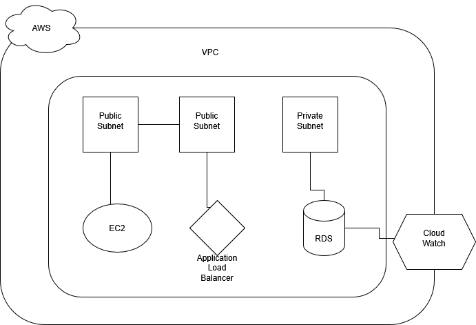

# AWS EC2 + RDS Flask WebApp (Documentation Project)

This repository documents the **deployment of a Flask web application** on **AWS EC2** instances connected to a **MySQL database in RDS**, with an **Application Load Balancer** and **CloudWatch monitoring**.  
It serves as a complete reference for how to design, deploy, and manage a basic 3-tier architecture on AWS.

---

##  Architecture Overview



**Architecture Components:**
1. **VPC** with public and private subnets  
2. **EC2 instances** (web app servers) in public subnets  
3. **RDS (MySQL)** in private subnet  
4. **Application Load Balancer (ALB)** in front of EC2s  
5. **CloudWatch + SNS** for monitoring and alerts  
6. **Security Groups** to control traffic flow  
7. **IAM Roles** for permissions (optional)  

---

##  Project Overview

**Goal:** Host a simple Flask-based web application that connects to an RDS MySQL database within a secure AWS VPC.

**Use Case:** Demonstrates real-world cloud deployment steps used in DevOps and cloud engineering.

---

##  Tools & Technologies Used

| Category | Tools |
|-----------|--------|
| Cloud | AWS (EC2, RDS, VPC, ALB, CloudWatch) |
| Programming | Python (Flask) |
| Database | MySQL (Amazon RDS) |
| OS | Amazon Linux 2 |
| Networking | Subnets, Route Tables, Security Groups |
| Monitoring | CloudWatch |
| Version Control | Git & GitHub |

---

##  Step-by-Step Deployment Summary

### ** VPC Setup**
- Created custom VPC (`devops-vpc`) with CIDR `10.0.0.0/16`
- Created:
  - Two **Public Subnets** (`10.0.1.0/24`, `10.0.3.0/24`)
  - One **Private Subnet** (`10.0.2.0/24`)
- Attached **Internet Gateway** and configured Route Tables

---

### ** Security Groups**
- **web-sg** for EC2  
  - Inbound: SSH (22), HTTP (80)
  - Outbound: All traffic
- **rds-sg** for RDS  
  - Inbound: MySQL (3306) from `web-sg`

---

### ** EC2 Instances**
- Launched Amazon Linux 2 instances in both public subnets  
- Installed Python, Flask, and MySQL client:
  ```bash
  sudo yum install python3 -y
  sudo pip3 install flask pymysql

  ---

### ** RDS (MySQL) Setup**

Engine: MySQL 8.0
Instance identifier: devops-db
Master username: admin
Deployed in private subnet
Connected to EC2 via internal endpoint


---

### ** Application Load Balancer**

Created ALB (webapp-alb)
Scheme: Internet-facing
Added both EC2 instances as Targets
Health check path: /
ALB DNS → used to access the web app

---

### ** CloudWatch Alarms**

Metric: EC2 CPUUtilization
Threshold: > 70% for 5 minutes
SNS topic created for email alerts

---

### **Output (Expected)**
When deployed, the web application shows:

Users in Database:
- Alice
- Bob


###**Kindly go through the screenshots for visuals of setup and output**

